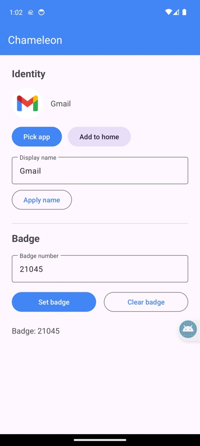

# Chameleon Badge

A small demo Android app (package `com.chameleon.badge`) for launcher notification-badge
behavior testing. It can:

- **Set the notification badge to any number** (tested up to 20 000) on its own icon or
  on a borrowed identity, using a persistent notification with `setNumber()` plus the
  vendor badge extras (`badge`, `miui.intent.extra.BADGE_COUNT`, Huawei
  `CHANGE_BADGE` broadcast).
- **Borrow another installed app's identity**: pick any installed app; a pinned home
  shortcut is created (or updated) with that app's icon and name, and the badge
  notification is tied to the shortcut via `setShortcutId()`, so launchers that
  attribute `shortcutId` notifications (e.g. Lawnchair) put the counter pill on the
  mimic icon.
- Re-apply the saved badge on launch, so it survives reboots and process death.
  Requires notification permission (Android 13+) and a launcher with notification
  access enabled.

## Screenshot



The identity section borrows an installed app's icon and name (here: Gmail); the badge
section sets the counter. `ADD TO HOME` pins the mimic shortcut into the launcher.

## Build

Requires JDK 17 and Android SDK (platform 34). No local.properties path is committed.

```
./gradlew assembleDebug
# APK: app/build/outputs/apk/debug/app-debug.apk
```

Install:

```
adb install -r app-debug.apk
```

## Usage

1. Open Chameleon → **Pick app** → choose the app to mimic → **Apply name**.
2. Enter a badge number (e.g. `14924`) → **Set badge**.
3. **Add to home** asks the default launcher to pin the mimic shortcut (borrowed icon
   + name). The counter appears on it once the launcher has notification access.
4. **Clear badge** removes the notification and counter.

## Recommended launcher fork

For a fully identical mimic icon (the third-party shortcut corner badge is never
drawn) and a notification counter that scales up to **20,000** on a pill-shaped badge,
use this app with **[lawnchair-icon-badge-uncapped](https://github.com/brendangreenley/lawnchair-icon-badge-uncapped)** —
a Lawnchair 15 fork that uncaps the badge counter and removes the shortcut marker.

## Licensing

Copyright 2026 brendangreenley, licensed under the Apache License 2.0 — see [LICENSE](LICENSE).
Uses AndroidX and Material Components (also Apache 2.0).
